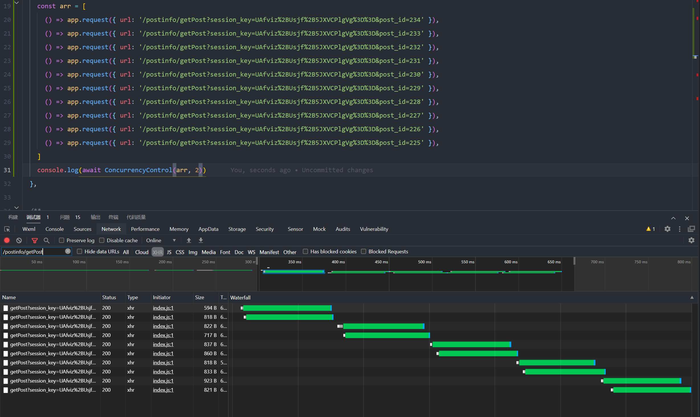
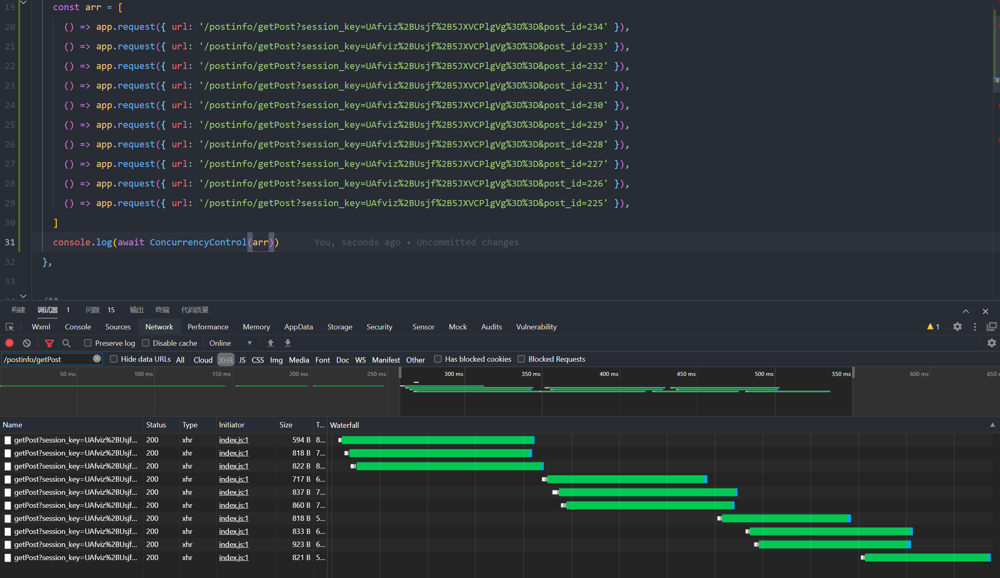

##### 限制同时发生的 Promise 数量

### 示例

```javascript
import ConcurrencyControl from "doyle-concurrency-control";

// promiseReqArray: (() => Promise<Response>)[]
// 数组每个元素最后返回的是一个 Promise
const promiseReqArray = [
    () => { return fetch("/api/example1"); },
    // ...
    () => fetch("/api/exampleN")
];

// 自定义最大并发 2
ConcurrencyControl(promiseReqArray, 2).then((res) => {
    // res: Array<{ res: any, status: 'fulfilled' | 'reject' }>
    console.log(res);
});

// 默认最大并发 3
ConcurrencyControl(promiseReqArray).then((res) => {
    // res: Array<{ res: any, status: 'fulfilled' | 'reject' }>
    console.log(res);
});
```




